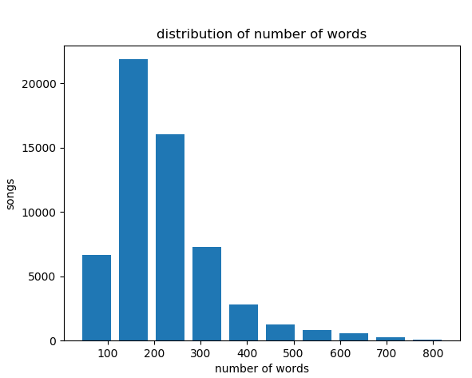

# Python_Song_Dataset

### Download the dataset with the webget file we made in the class or use the dataset uploadet here.
or
### Do it your own way with your favorite module. Link to the dataset: https://github.com/KasperOnFire/ImpossibleTechnology/blob/master/Datasets/songdata.csv

# OBS! Be patient, it takes some time from you run the program to it shows the results (answers) 
--> give advice to make the code faster, please!

#### You need to import:
- webget (if you want to download the file else not)
- pandas module
- collections
- matplotlib.pyplot

 
# ANSWERS TO QUESTIONS:

#### QUESTION 1: What is the most used words in the songs?
| Word			| Amount   |
|:--------------------:	|:--------:|
|The			| 446.872  |

#### QUESTION 2: How many times are each word repeated in a song? 
| Word			| Amount   |
|:--------------------:	|:--------:|
|the			| 446.872  |
|I			| 415.921  |
|you			| 326.267  |
|to			| 273.065  |
|a			| 235.203  |
|me			| 173.653  |
|and			| 164.335  |
|my			| 151.635  |
|in			| 145.320  |
|of			| 134.085  |

#### QUESTION 3: What song uses the word "X" the most time? (X meaning a specific word, choose your own!)
### Word: fuck
| Id	    | Title     	     		   | Amount |
|:---------:|:------------------------------------:|:------:|
|128	    | Mr. Bake-O	 		   | 10     |
|126	    | Creepin' On The Mayor  		   | 8      |
|129	    | Steve Polychronopolous 		   | 6      |
|131	    | The Psychotic Legend Of Uncle Donnie | 5      |
|132	    | Welcome My Son			   | 1      |

#### QUESTION 4: What is the average number of words per song?
- All words in the dataset: 12.653.383
- All lines in the dataset: 57.650

Average numbers of words in songs are: 219,5

#### QUESTION 5: Show the distribution of number of words in the songs.

